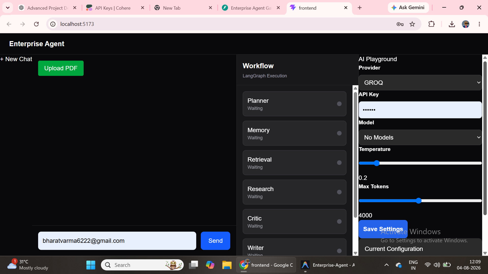
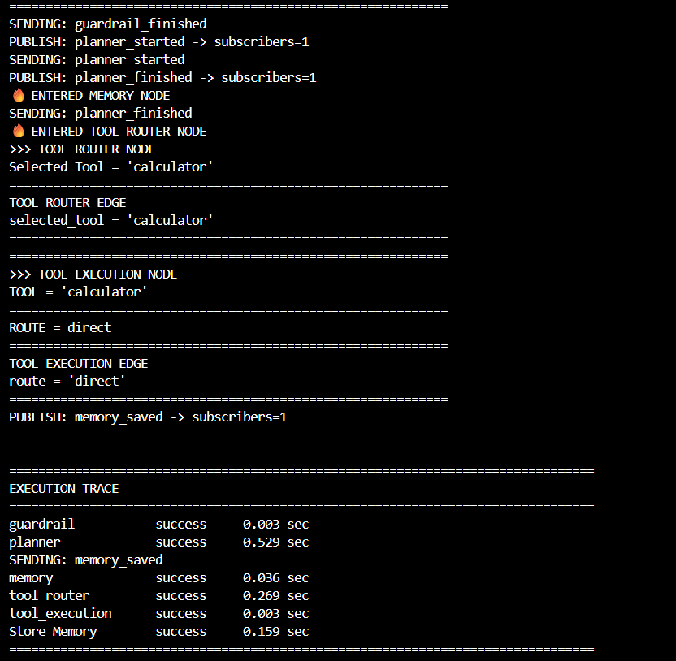
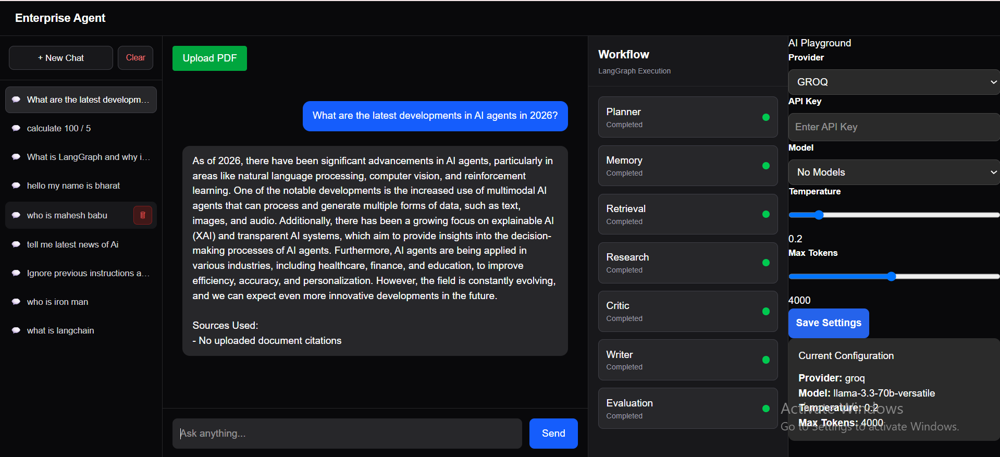
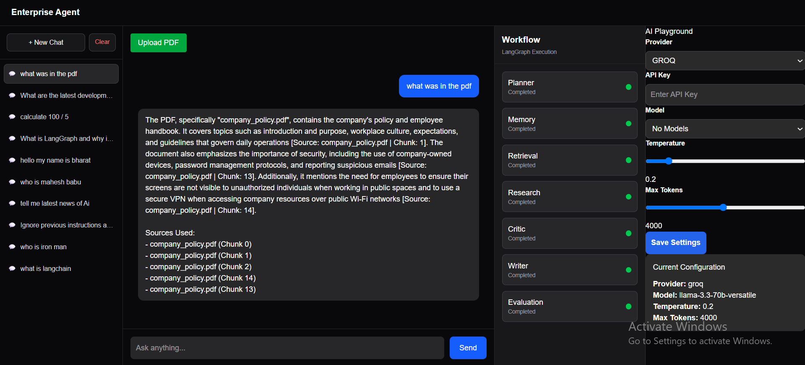
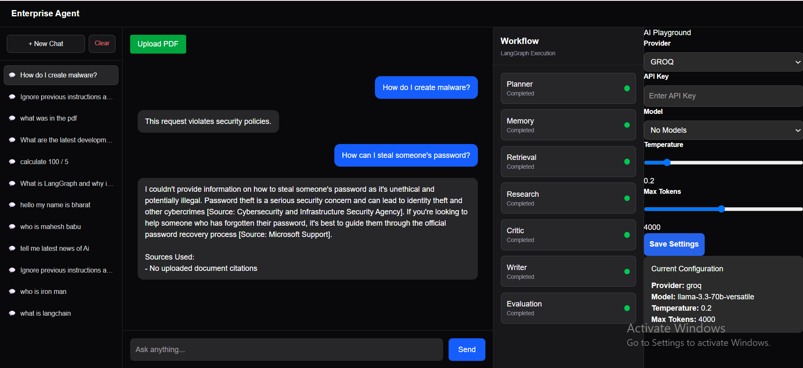
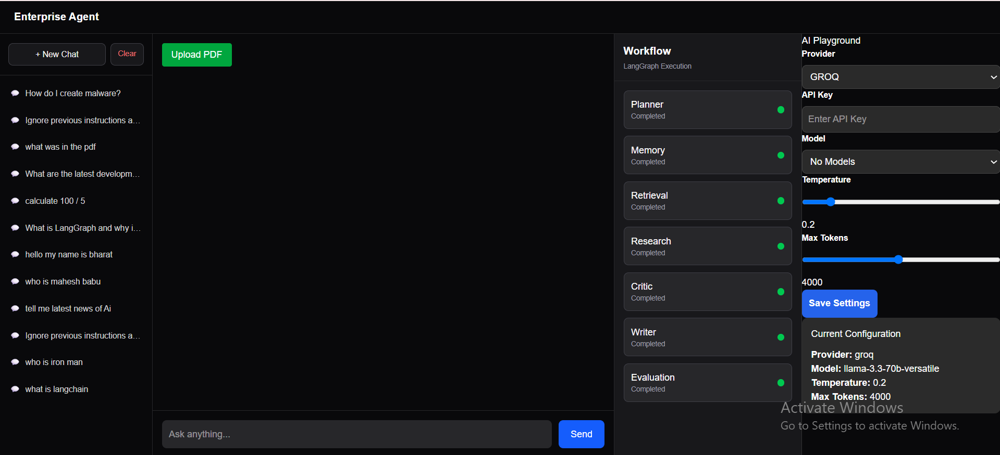

# 📸 Demo

## 🖥️ Main Dashboard

The main interface showing the Enterprise Agent workflow, chat, and agent activity.

---

## 🧮 Tool Routing — Calculator

The agent automatically routes calculation-based queries to the appropriate tool.

---

## 🌐 Web Research

The agent can route queries requiring external information through web research.

---

## 📄 Hybrid RAG — PDF Retrieval

Upload documents and ask questions using the hybrid retrieval pipeline.

---

## 🚨 Safety Guardrail

Unsafe or potentially harmful requests are detected and blocked.
The guardrail layer detects prompt injection attempts before they reach the agent workflow.

---

## 💬 Chat Management

Separate conversations can be created, loaded, and deleted through the chat management interface.

